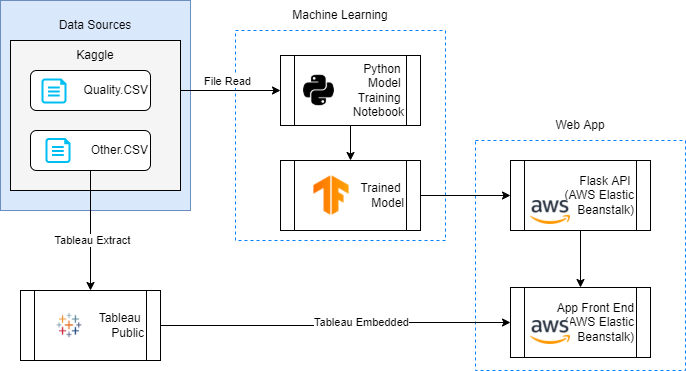

# The Wine Quality Predictor App

# Purpose and motivation

The [Wine Quality Predictor App](http://winepredict-env.eba-knafuyum.ap-southeast-2.elasticbeanstalk.com/) allows users to predict the quality of wine based on a series of chemical parameters. 
The app is primarily for prospective winemakers to see whether theyre on to a winner, or whether its time to head back to the old drawing board.

The app also provides some context to Wine and Alchol consumption.
Alcohol is quite a big part of the australian culture & industry. In this project we want to explore the different impact and habit related to alcohol around the world.


The app is hosted on AWS using Elastic Beanstalk (ELB). 

# Repo structure 
```
Resources/                                  # contains csv's used in the project
images/                                     # contains images used for the README
app/    
    |__ app.py                              # contains the main flask app logic and endpoints 
    |__ prediction.py                       # contains the code used to perform the prediction
    |__ Procfile                            # tells Elastic Beanstalk how to run the app 
    |__ requirements.txt                    # python dependencies for app 
    |__ build.bat                           # shell script to build the zip file 
model/    
    |__ train_model.ipynb                   # where the model is trained
README.md                                   # all you need to know is in here 
```

# Solution 

## Solution architecture

The solution architecture diagram was created using: https://draw.io/ 

Icons were taken from: https://www.flaticon.com/ and https://www.vecta.io/ 




# Running locally 

Follow the steps below to run the code locally: 

- [1. Run the application locally ](#run-the-application-locally)

### Run the application locally 

To run the application locally, simply run 

```
cd app
python app.py
```

You should see the following which indicates that your app is running locally: 
```
* Serving Flask app 'app' (lazy loading)
* Environment: production
WARNING: This is a development server. Do not use it in a production deployment.
Use a production WSGI server instead.
* Debug mode: on
* Running on http://127.0.0.1:5000/ (Press CTRL+C to quit)
* Restarting with stat
* Debugger is active!
```

# AWS deployment  

Follow these steps to deploy the solution to AWS. 


### Deploy ETL to AWS Elastic Beanstalk 

#### Build app

Before we can deploy the app, we need to first build the app. 

Building the app refers to packaging and compiling the app so that it is in a state that can be readily deployed onto the target platform (e.g. AWS, Heroku, Azure, GCP, etc). We can skip the compilation since Python is not a compiled language, however we still need to package the app. 

To package the app, we will run the following lines of code: 


<b>windows</b>:

Note for Windows-only - You will need to install 7z (7-zip) which is a command line tool used for zipping files. 

1. Go to https://www.7-zip.org/ and download the version for your windows PC (usually 64-bit x64)
2. Run the installer .exe file 
3. Add the path `C:\Program Files\7-Zip` to your environment variables `path` 

```
7z a -tzip web-app.zip templates static
7z a -tzip web-app.zip app.py prediction.py requirements.txt Procfile
```

This will produce a `.zip` file which contains all the code and library packages required to run the app on AWS Lambda.  

For re-use, we've stored the commands in [build.bat](app/build.bat). 

You can just build the app by running 

<b>windows</b>:
```
build.bat
```

#### Deploy app

1. In the AWS Console, search for "Elastic Beanstalk". 
2. Choose the region closest to you on the top-right e.g. Sydney (ap-southeast-2)
3. Select "Create Application" 
4. Configure ELB. Note: Unless specified, leave the settings to default. 
    1. Provide the application name 
    2. Select Platform: "Python"
    3. Select Platform Branch: "Python 3.8 running on 64bit Amazon Linux 2"
    4. In the "Application code" section, select "Upload your code"
        - Select "Local file" > "Choose file" and select the `.zip` file you have built 
    5. Select "Configure more options" 
        1. Select "Capacity" > "Edit" 
            - This model requires a reasonable amount of capacity to perform the machine learning (c5.xlarge used in demo).
            - Select "Save" 
    6. Select "Create app" 

